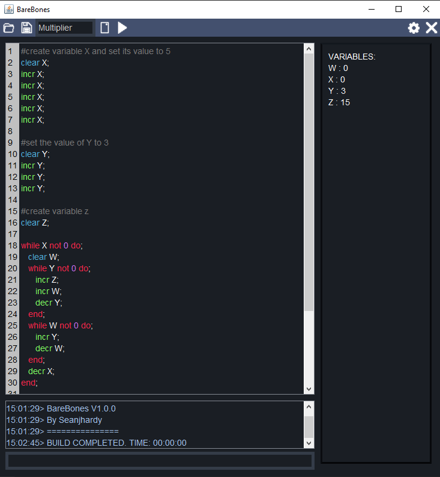

# UoSSpaceCadetsChallenge2
A simple IDE for the "barebones" language. Complete with a console, helpful error warnings, code highlighting, variables shown in the debugger, and a file naming, saving and loading system

